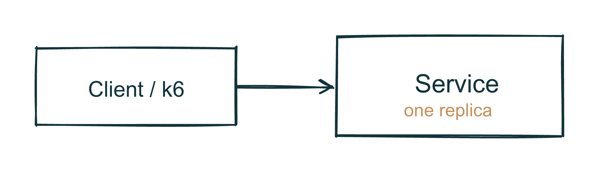
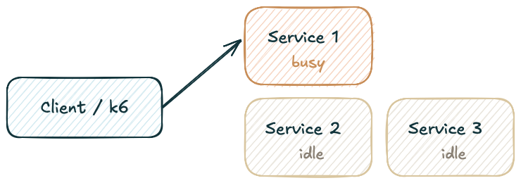
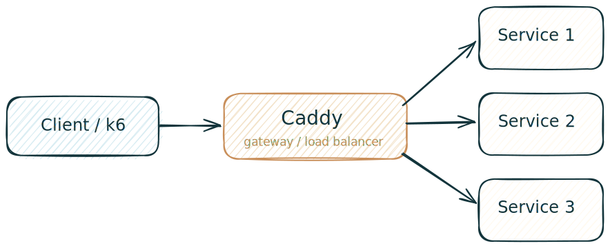

<!-- _class: lead -->
# Gateways, Load Balancers, and Observability with k6

COMPSCI 426

- Reverse proxies, gateways, load balancers
- Caddy and k6
- Comparing system behavior under load

<!--
Presenter note:
- 1-2 min
- Open with: "You scaled your service. Great. Who decides where the next request goes?"
-->

---

<!-- _class: lead -->
# Today

1. Concepts
2. Tools
3. Scenario architecture preview
4. Reading k6 output
5. Debrief

<!--
Presenter note:
- 1 min
- The architecture preview is brief and supports the class activity.
-->

---

# Learning Goals

By the end of class, you should be able to:

- explain gateways and load balancers
- configure Caddy as a reverse proxy
- run and interpret a k6 test
- compare deployment setups under load

<!--
Presenter note:
- 1 min
-->

---

# The Core Question

> You scaled your service to 3 replicas. Great. Who decides where the next request goes?

<!--
Presenter note:
- 1 min
- Let this land before moving into the setup slide.
-->

---

# The Problem Setup

You scaled your service to 3 replicas.

Now what?

- Who decides which replica gets the next request?
- How does outside traffic find the right place?
- How would you know whether the setup is working?

**Theme:** architecture choices should create measurable effects.

<!--
Presenter note:
- 3 min
- Start Part 1.
-->

---

# Reverse Proxy vs Forward Proxy

## Reverse proxy

- sits in front of servers
- forwards traffic to backends
- hides service topology

## Forward proxy

- sits in front of clients
- represents clients to the outside world
- often used for filtering or privacy

**Shortcut:** reverse proxy protects servers; forward proxy represents clients.

<!--
Presenter note:
- 4 min
-->

---

# What a Gateway Does

A gateway is the **front door** of your system.

- routes requests
- terminates TLS
- can enforce auth
- can enforce rate limits
- centralizes policy

Every outside request usually touches it first.

<!--
Presenter note:
- 4 min
- Tie to protecting downstream systems.
-->

---

# Where Load Balancing Fits

A load balancer is one key concern inside or alongside a gateway.

- spreads traffic across replicas
- prevents one instance from taking all the heat
- improves throughput
- improves latency consistency

Without routing, extra replicas may exist but still do no work.

<!--
Presenter note:
- 4 min
- Foreshadow Scenario 2.
-->

---

# Common Strategies

- **Round robin**: take turns across replicas
- **Least connections**: prefer the least busy backend
- **IP hash**: send the same client toward the same backend

The question to keep asking:

**How would you know whether the strategy is actually working?**

<!--
Presenter note:
- 4 min
- Close Part 1 on the observability question.
-->

---

# Why This Matters Here

This applies directly to what you have built:

- scaled services need smart traffic flow
- pub-sub systems benefit from gateway rate limits
- resilient workers still depend on a stable entry point
- projects need evidence, not guesses, about load behavior

<!--
Presenter note:
- 3-4 min
- End Part 1 around 20-25 min.
-->

---

# Meet Caddy

```caddy
:80 {
    reverse_proxy service:3000 {
        lb_policy round_robin
    }
}
```

- readable config
- small surface area
- easy to demo in Docker

Same ideas transfer to nginx and cloud load balancers.

<!--
Presenter note:
- 5 min
- Part 2, Caddy.
-->

---

# Meet k6

k6 is a developer-oriented load testing tool.

- scripts are JavaScript
- VUs model concurrent users
- duration controls how long the test runs
- reports throughput, latency percentiles, and failures

**Important:** k6 tells you what changed, not automatically why.

<!--
Presenter note:
- 5 min
- Part 2, k6.
-->

---

<!-- _class: diagram -->
# Scenario 1 Architecture

<!---->


- one replica
- no gateway
- no load balancer
- direct hit on one service

What you learn: baseline behavior under concurrent traffic.

<!--
Presenter note:
- 1 min
- Quick preview only.
-->

---

<!-- _class: diagram -->
# Scenario 2 Architecture



- three replicas exist
- traffic still hits only one replica
- architecture changed, traffic pattern did not

What you learn: scaling alone is not enough.

<!--
Presenter note:
- 1-2 min
- This slide makes the contrast visible.
-->

---

<!-- _class: diagram -->
# Scenario 3 Architecture



- one front door
- requests distributed across replicas

What you learn: routing changes measured system behavior.

<!--
Presenter note:
- 1-2 min
- Keep this as a bridge into the class activity.
-->

---

# One Workload, Three Traffic Paths

- Scenario 1: one service, direct traffic
- Scenario 2: three services, but one still gets the load
- Scenario 3: one front door, traffic distributed across replicas

What stays constant:

- same app shape
- same style of workload

What changes:

- the traffic path through the system

<!--
Presenter note:
- 1 min
- This makes the comparison frame explicit.
-->

---

# k6 Output: First Pass

```text
scenarios: (100.00%) 1 scenario, 20 max VUs
default: 20 looping VUs for 30s

http_req_duration: avg=142ms p(95)=244ms
http_req_failed: 0.00%
http_reqs: 423  14.08/s
iteration_duration: avg=1.14s
vus: 20
```

Read it in this order:

1. concurrency
2. latency
3. failures
4. throughput

<!--
Presenter note:
- 3-4 min
- Start Part 4.
-->

---

# k6 Output: What Matters

- **p95 vs average**
  - average can hide bad tail behavior
- **`http_req_failed`**
  - tells you that requests failed, not why
- **iterations vs requests**
  - one loop can make multiple requests
- **VUs vs requests/sec**
  - concurrency and throughput are related, not identical

<!--
Presenter note:
- 6-7 min
- Main interpretation slide.
-->

---

<!-- _class: quote -->
# How to Talk About Results

Push past “it was faster.”

Ask:

- which metric changed?
- by how much?
- was the change consistent?
- what architecture change explains it?
- what should you inspect next?

Use k6 to guide investigation, not to end it.

<!--
Presenter note:
- 3-4 min
- Finish Part 4 around 10-15 min.
-->

---

# Debrief

This connects back to the course arc:

- you can now verify resilience under load
- you have language for front-door traffic control
- you can reason about whether a project handles real traffic
- you can compare architectures using evidence

<!--
Presenter note:
- 4-5 min
- Start Part 5.
-->

---

# Closing Question

If your gateway goes down, what happens to your entire system?

That question leads directly to:

- single points of failure
- high availability gateways
- project-level reliability thinking

<!--
Presenter note:
- 2-3 min
- End Part 5 around 5-10 min total.
-->
