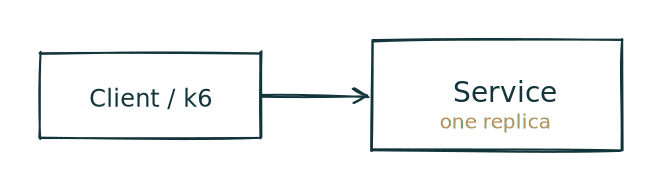
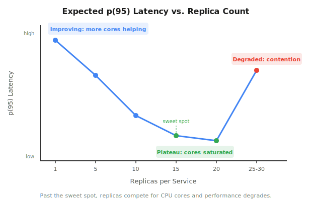

<!-- _class: lead -->
# Load Testing That Actually Tests Load

COMPSCI 426

- Why last time's load test didn't work
- Fixing the server and the test
- Observing scaling under real pressure
- Breaking the system and finding limits

<!--
Presenter note:
- 1-2 min
- Open with: "Last time, we ran load tests against three architectures and the results were identical. Today we figure out why, and fix it."
-->

---

<!-- _class: lead -->
# Today

1. What went wrong last time
2. What we changed
3. Activity: three scenarios
4. Scaling experiment debrief
5. Closing

<!--
Presenter note:
- 1 min
-->

---

# Learning Goals

By the end of class, you should be able to:

- explain why a load test can fail to reveal architecture differences
- distinguish blocking (CPU-bound) from non-blocking (async) server work
- design a k6 test that saturates a server
- interpret scaling results and identify resource ceilings

<!--
Presenter note:
- 1 min
-->

---

<!-- _class: quote -->
# The Problem

> We ran three architectures through k6 last time. Single replica. Three replicas. Three replicas with a load balancer. The numbers were nearly identical. Why?

<!--
Presenter note:
- 1-2 min
- Let the class think before revealing the answer.
-->

---

# Problem 1: The Test Throttled Itself

```js
export const options = { vus: 20, duration: '30s' };
export default function () {
  http.get(targetUrl);
  sleep(1);  // each VU waits 1 full second between requests
}
```

- Each VU: one request (~200ms), then **1 second idle**
- 20 VUs = ~16 req/s max
- The server was never stressed
- **Bottleneck: the test client, not the server**

<!--
Presenter note:
- 3-4 min
- Emphasize that sleep(1) is the client throttling itself.
-->

---

# Problem 2: The Server Work Was Non-Blocking

```js
await sleep(delayMs);  // setTimeout -- does NOT block the event loop
```

- `setTimeout` is async: Node.js handles thousands concurrently
- 20 VUs sleeping for 200ms? Trivial for one process
- No queuing, no contention, no reason for replicas to help

**If the server can handle everything thrown at it, extra replicas have nothing to fix.**

<!--
Presenter note:
- 3-4 min
-->

---

<!-- _class: diagram -->
# Last Time vs Today


<!--
Presenter note:
- 2-3 min
- Walk through the timeline diagram. Left: VUs mostly sleeping. Right: VUs sending back-to-back.
-->

---

# Fix 1: CPU-Bound Blocking Work

```js
function cpuWork(ms) {
  const end = Date.now() + ms;
  while (Date.now() < end) {}  // blocks the event loop
}
```

- Occupies the event loop for the full 500ms
- One request at a time per process
- Max throughput: ~2 req/s per replica

This simulates real CPU work: image processing, encryption, computation.

<!--
Presenter note:
- 3-4 min
-->

---

# Fix 2: No Sleep, More VUs

```js
export const options = { vus: 100, duration: '30s' };
export default function () {
  http.get(targetUrl);
  // no sleep -- next request immediately
}
```

- 100 VUs sending requests as fast as the server can respond
- The server is now the bottleneck, not the client
- With 1 replica: ~2 req/s, massive queuing
- With 3 replicas + LB: ~6 req/s, 1/3 the latency

<!--
Presenter note:
- 2-3 min
-->

---

# Service Level Objectives (SLOs)

How do you know if your system is "fast enough"?

- **SLI** (Service Level Indicator): a metric you measure — latency, error rate, throughput
- **SLO** (Service Level Objective): a target for that metric — "p95 latency < 500ms"
- **SLA** (Service Level Agreement): a contract with consequences if the SLO is missed

SLOs turn subjective feelings ("it feels slow") into objective measurements.

You can have SLOs without SLAs. Most internal services define SLOs to guide engineering decisions.

<!--
Presenter note:
- 3-4 min
- Emphasize that SLOs are engineering targets, SLAs are business contracts.
- Students will see SLOs enforced as k6 thresholds in Scenario 3.
-->

---

# SLOs in Practice

An SLO has three parts:

1. **The SLI**: what you measure (e.g., request latency)
2. **The target**: what "good enough" means (e.g., p95 < 500ms)
3. **The window**: the time period (e.g., rolling 24 hours)

In k6, thresholds are SLOs:

```js
thresholds: {
  http_req_duration: ['p(95)<2000'],  // p95 latency under 2s
  http_req_failed: ['rate<0.10'],     // error rate under 10%
}
```

When a threshold fails, the system violated that SLO under load. This tells you your **capacity limit** — when to scale.

<!--
Presenter note:
- 2-3 min
- Connect directly to Scenario 3 where students will see thresholds pass and fail.
- Reference the SLO doc linked from the activity for more detail.
-->

---

# Activity Overview

Three scenarios, same pattern as last time, but now the differences are measurable:

1. **Scenario 1**: 1 replica, CPU-bound — your baseline
2. **Scenario 2**: 3 replicas + Caddy load balancer — expect ~3x throughput
3. **Scenario 3**: Ramping to 800 VUs — find the breaking point

Plus a scaling experiment: what happens as you go from 5 to 30 replicas?

<!--
Presenter note:
- 2-3 min
- Brief preview before sending students to the activity.
-->

---

<!-- _class: diagram -->
# Scenario 1: Single Replica



- 100 VUs → 1 process that blocks for 500ms per request
- Max throughput: ~2 req/s
- Expect very high latency

<!--
Presenter note:
- 1 min
-->

---

<!-- _class: diagram -->
# Scenario 2: Caddy + 3 Replicas


- Caddy round-robins across 3 independent event loops
- Each can handle ~2 req/s → ~6 req/s total
- Expect ~1/3 the latency of Scenario 1

<!--
Presenter note:
- 1-2 min
-->

---

# Scenario 3: Breaking the System

Same architecture as Scenario 2, but:

- VUs ramp from 100 → 300 → 500 → 800
- Containers limited to 64MB RAM, 0.5 CPU each
- k6 thresholds define pass/fail:
  - p(95) < 2 seconds
  - error rate < 10%

Watch for the inflection point where the system stops coping.

<!--
Presenter note:
- 1-2 min
-->

---

<!-- _class: lead -->
# Activity Time

<!--
Presenter note:
- Send students to the activity document.
- Circulate and help with Docker issues.
-->

---

# Scaling Experiment Debrief

You ran the load test at r=5, 10, 15, 20, 25, 30 replicas per service.

Questions:

- Where did p(95) stop improving?
- Where did it get **worse**?
- Why?

<!--
Presenter note:
- 5-7 min
- Collect student numbers on the board if possible.
-->

---

<!-- _class: diagram -->
# The Scaling Curve



<!--
Presenter note:
- 3-4 min
- Walk through the three zones.
-->

---

# Why More Replicas Made Things Worse

- Each replica does a CPU-bound busy-wait for 500ms
- That requires a real CPU core for the full duration
- Past your machine's core count, replicas compete for CPU time
- The OS time-slices, making each replica's 500ms take longer
- More replicas = more context switches = worse for everyone

**This is the difference between concurrency and parallelism.**

Scaling out past your physical resource limit makes things worse, not better.

<!--
Presenter note:
- 4-5 min
- This is the key takeaway from the scaling experiment.
-->

---

# So What Do You Do?

When adding replicas on one machine stops helping:

- **Vertical scaling**: bigger machine, more cores
- **Horizontal scaling**: more machines, each with their own cores
- **Optimize the work**: can you reduce the 500ms? Cache results? Make it async?

In production, this is why:
- Kubernetes clusters span multiple nodes
- Cloud platforms charge by the core
- Autoscalers need both replica count **and** node count limits

<!--
Presenter note:
- 3-4 min
-->

---

# Key Takeaways

1. A load test that doesn't stress the server can't reveal architecture differences
2. CPU-bound work creates real contention; async I/O does not
3. Load balancing helps — but only up to the physical resource limit
4. Past that limit, adding replicas makes things worse
5. Use SLOs + load testing to find your capacity ceiling

<!--
Presenter note:
- 2-3 min
-->

---

<!-- _class: quote -->
# Closing Question

> Your system handles 6 req/s across 3 replicas on one machine. You need to handle 60 req/s. What is your plan?

[Full solution with step-by-step math](cq) — look only after you have done your own analysis.

<!--
Presenter note:
- 2-3 min
- Let students discuss briefly before walking through the answer.

Complete answer:

You need a 10x increase in throughput. You currently get ~2 req/s per replica,
so you need ~30 replicas actually doing useful work in parallel. As the scaling
experiment showed, you cannot run 30 CPU-bound replicas on one machine -- past
your core count, they compete for CPU and performance degrades.

The plan:

1. Figure out how many useful replicas one machine can run. From the scaling
   experiment, that is roughly the number of CPU cores on the machine. Call it N.
   On a typical student laptop with 8-10 cores, N might be around 10-15 replicas
   before contention kicks in.

2. Calculate how many machines you need. You need 30 working replicas. If each
   machine can effectively run N, you need ceil(30 / N) machines. With N=10,
   that is 3 machines.

3. Deploy across multiple machines. Each machine runs its own set of replicas
   behind a local load balancer (or the replicas register with a shared one).
   A global load balancer or DNS distributes traffic across the machines.

4. Consider optimizing the work itself. If you can reduce the 500ms CPU block
   to 250ms, each replica handles ~4 req/s instead of ~2. Now you only need
   15 replicas for 60 req/s, which might fit on 2 machines. Optimization
   reduces your infrastructure cost.

5. Plan for headroom. If 60 req/s is your expected peak, plan for more. SLOs
   should hold under peak load, not just average load. A common rule of thumb
   is to provision for 1.5-2x your expected peak.

Key points to draw out from student answers:
- "Just add 30 replicas" is wrong -- they saw this fail in the experiment.
- Multiple machines is the core answer -- this is horizontal scaling.
- Optimizing the work per request is a multiplier that reduces machine count.
- This is exactly why cloud platforms sell compute by the core and why
  Kubernetes clusters span multiple nodes.
-->
