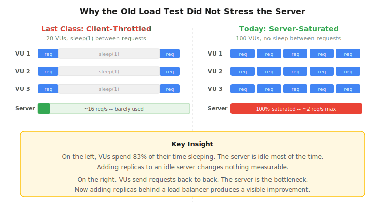
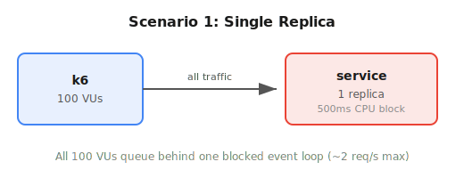
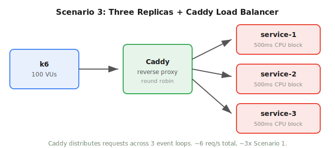

# 14 Load Testing That Actually Tests Load

## Activity

This activity revisits the three scenarios from Lecture 13 with a critical fix: a load test that actually saturates the server. Last time, the k6 results looked the same across all three scenarios. This time, you will see a measurable difference when replicas and load balancing are added.

## Setup

Download and unzip [14-ekit.zip](14-ekit.zip). This folder contains a directory for each scenario described below. All of the exploration and discovery you do will be within these folders.

## Why Last Time Did Not Work

In Lecture 13, you ran load tests against three architectures: a single replica, three replicas without load balancing, and three replicas behind Caddy. The expectation was that Scenario 3 would show better throughput and lower latency than Scenario 1. Instead, all three scenarios produced nearly identical k6 output. Here is why.

### Problem 1: The load test throttled itself

The old k6 script looked like this:

```js
export const options = { vus: 20, duration: "30s" };
export default function () {
  http.get(targetUrl);
  sleep(1); // each VU waits 1 full second between requests
}
```

Each virtual user sent one request (which took about 200ms for the server to respond), then **slept for 1 full second** before sending the next one. With 20 VUs, the maximum request rate was roughly 20 requests every 1.2 seconds, or about 16-17 requests per second. That is trivial load. A single Node.js process can handle far more than that without breaking a sweat.

When the server is not saturated, adding more replicas behind it cannot improve anything because there is nothing to improve. The bottleneck was the **test client pacing itself**, not the server being overwhelmed.

### Problem 2: The server work was non-blocking

The old server simulated work with an async sleep:

```js
function sleep(ms) {
  return new Promise((resolve) => setTimeout(resolve, ms));
}

const server = http.createServer(async (_req, res) => {
  await sleep(delayMs); // non-blocking -- does NOT tie up the event loop
  // ...
});
```

`setTimeout` is asynchronous and non-blocking. While one request is "sleeping," Node.js is free to accept and start processing other requests. A single Node.js event loop can hold thousands of concurrent timers simultaneously. Even if the k6 test had sent traffic faster, 20 concurrent async sleeps would not have stressed a single process at all.

Because the server could handle all incoming requests concurrently within one process, there was no queuing, no contention, and no reason for extra replicas to help.

### The lesson

A load test only reveals the effect of an architecture change when the test generates enough pressure to expose the bottleneck. If the client throttles itself (via `sleep(1)`) or the server can handle all requests concurrently (via async I/O), adding replicas has nothing to fix. The numbers will look the same no matter how many replicas you add.

This is a real-world problem. Teams scale out their services, see no improvement in their dashboards, and blame the infrastructure. Often the issue is that their load test (or their real traffic) was never heavy enough to saturate the original setup in the first place.



## What Changed in This Activity

Two things are different from Lecture 13:

### 1. The server now does CPU-bound blocking work

Instead of `await sleep(delayMs)`, the server now uses a busy-wait loop:

```js
function cpuWork(ms) {
  const end = Date.now() + ms;
  while (Date.now() < end) {} // blocks the event loop
}
```

This occupies the Node.js event loop for the full 500ms. While one request is being processed, all other incoming requests must wait. A single Node process can now serve at most ~2 requests per second (1000ms / 500ms). This simulates the kind of CPU-intensive work that actually creates contention: image processing, encryption, data transformation, or complex computation.

### 2. The k6 test sends traffic at full speed

The new load test uses 100 virtual users with no sleep between requests:

```js
export const options = { vus: 100, duration: "30s" };
export default function () {
  http.get(targetUrl);
  // no sleep -- send the next request immediately
}
```

Each VU fires requests as fast as the server can respond. With a single replica limited to ~2 req/s, 100 VUs will create massive queuing. With 3 replicas behind a load balancer, the work gets spread across 3 event loops running in parallel, and you should see roughly 3x the throughput.

### What you should expect to see

- **Scenario 1** (1 replica): ~2 req/s, very high latency (requests queue behind a blocked event loop)
- **Scenario 2** (3 replicas, no LB): Nearly identical to Scenario 1, because all 100 VUs still target service-1 only
- **Scenario 3** (3 replicas + Caddy): ~6 req/s, roughly 1/3 the latency of Scenarios 1 and 2
- **Scenario 4** (3 replicas + Caddy, ramping to 800 VUs): the system holds up at first, then degrades and eventually breaks

## Scenario 1: Baseline Service (CPU-Bound)



In this scenario, you will measure the behavior of a single service instance doing CPU-bound work. This is your baseline.

### Your goal

By the end of this scenario, you should be able to answer this question:

How does a single replica behave when it can only process one request at a time and 100 users are competing for its attention?

### Files in this folder

- `scenario-01/docker-compose.yml`: starts one service container and exposes it on port `3000`
- `scenario-01/app/server.js`: blocks the event loop for 500ms per request (CPU-bound work)
- `scenario-01/app/Dockerfile`: builds the service image
- `scenario-01/tools/`: builds a utility container with `bash`, `curl`, `jq`, `k6`, and other helpful command-line tools
- `scenario-01/results/`: save your output files and notes here
- `scenario-01/load-test.js`: sends load directly to the service with no pauses between requests

### Step 1: Start the service

From `scenario-01/`, run:

```bash
docker compose up --build
```

Leave that terminal running.

### Step 2: Open a shell in the tools container

In a second terminal, from `scenario-01/`, run:

```bash
docker compose exec tools bash
```

You are now inside a container with the class scenario folder mounted at `/workspace`.

### Step 3: Confirm the service works

From inside the tools container, run:

```bash
curl -s http://service:3000/ | jq
```

You should get a JSON response. Notice that it takes about 500ms to respond because the server blocks for the full duration.

### Step 4: Run the load test

From inside the tools container, run:

```bash
mkdir -p results
k6 run --summary-export results/k6-summary.json load-test.js | tee results/k6-output.txt
```

Because `/workspace` is a bind mount to this folder, everything in `results/` will be saved in `scenario-01/results/` on your machine.

### Step 5: Record what you observe

Write down:

- requests/sec
- p95 latency
- error rate
- anything surprising in the raw k6 output

Pay close attention to the request duration. With 100 VUs competing for a single process that blocks for 500ms per request, expect high latency and low throughput.

### Before You Analyze Your Results

Read [the k6 analysis guide](./k6-guide) before you write your conclusions. It walks through example output and shows you how to turn the raw numbers into an explanation of system behavior.

### Step 6: Reflect

Answer this question before moving on:

What does this baseline tell you about the limits of a single process that does CPU-bound work?

Record your observations and answer in `results/notes.md`.

### Step 7: Stop the scenario

When you are done, run:

```bash
exit
docker compose down
```

## Scenario 2: Scaled Services Without Load Balancing


In this scenario, you will run three service instances, but you will still send all traffic to only one of them. The goal is to confirm that replicas alone do not help when the traffic pattern does not change.

### Your goal

By the end of this scenario, you should be able to answer this question:

> If you add replicas but keep sending traffic to only one instance, what improvement should you expect?

### Files in this folder

- `scenario-02/docker-compose.yml`: starts three service containers on ports `3001`, `3002`, and `3003`
- `scenario-02/app/server.js`: blocks the event loop for 500ms per request, tracks per-container request count
- `scenario-02/app/Dockerfile`: builds the service image used by all three containers
- `scenario-02/tools/`: builds a utility container with `bash`, `curl`, `jq`, `k6`, and other helpful command-line tools
- `scenario-02/results/`: save your output files and notes here
- `scenario-02/load-test.js`: sends all load to service-1 only

### Step 1: Start the services

From `scenario-02/`, run:

```bash
docker compose up --build
```

Leave that terminal running.

### Step 2: Open a shell in the tools container

In a second terminal, from `scenario-02/`, run:

```bash
docker compose exec tools bash
```

You are now inside a container with the class scenario folder mounted at `/workspace`.

### Step 3: Confirm all three services work

From inside the tools container, run:

```bash
curl -s http://service-1:3000/ | jq
curl -s http://service-2:3000/ | jq
curl -s http://service-3:3000/ | jq
```

Each service should respond with JSON. Notice that each container has its own hostname.

### Step 4: Make the traffic pattern visible

Before you run k6, reset the counters:

```bash
curl -s -X POST http://service-1:3000/reset | jq
curl -s -X POST http://service-2:3000/reset | jq
curl -s -X POST http://service-3:3000/reset | jq
```

Now send a few manual requests to only `service-1`:

```bash
# This is a bash for-in loop - write this all on a single line
for i in $(seq 1 5); do curl -s http://service-1:3000/ | jq -r '.hostname + " request #" + (.requestCount | tostring)'; done
```

Check the counters:

```bash
curl -s http://service-1:3000/stats | jq
curl -s http://service-2:3000/stats | jq
curl -s http://service-3:3000/stats | jq
```

You should already see the contrast: one service is doing work, and the others are completely idle.

### Step 5: Run the load test

From inside the tools container, run:

```bash
mkdir -p results
k6 run --summary-export results/k6-summary.json load-test.js | tee results/k6-output.txt
```

This script targets only `http://service-1:3000/`. All 100 VUs are queuing behind a single blocked event loop.

Because `/workspace` is a bind mount to this folder, everything in `results/` will be saved in `scenario-02/results/` on your machine.

### Step 6: Inspect the counters after k6

Run:

```bash
curl -s http://service-1:3000/stats | tee results/service-1-stats.json | jq
curl -s http://service-2:3000/stats | tee results/service-2-stats.json | jq
curl -s http://service-3:3000/stats | tee results/service-3-stats.json | jq
```

These files will make it easy to compare how much traffic each replica actually handled. Service-2 and service-3 should show zero or near-zero request counts.

### Step 7: Compare your results

Compare this scenario against Scenario 1 and write down:

- requests/sec
- p95 latency
- error rate
- whether the numbers changed much from the baseline
- how the request counters differed across the three replicas

The throughput and latency numbers should look nearly identical to Scenario 1. This is the point: replicas that do not receive traffic cannot improve performance.

### Before You Analyze Your Results

Read [the k6 analysis guide](./k6-guide) before you write your conclusions. It explains which k6 metrics matter most and how to compare one system configuration to another.

### Step 8: Reflect

Answer this question before moving on:

> You now have three service processes running, but the k6 numbers look the same as having one. Why?

Record your observations and answer in `results/notes.md`.

If you want to make the point even more obvious, run `docker compose logs service-1 service-2 service-3` in another terminal and compare how noisy each container is.

### Step 9: Stop the scenario

When you are done, run:

```bash
exit
docker compose down
```

## Scenario 3: Load Balancing with Caddy



In this scenario, you will put Caddy in front of three service instances and send traffic through it. The goal is to see a measurable improvement now that the load balancer can distribute CPU-bound work across multiple event loops.

### Your goal

By the end of this scenario, you should be able to answer this question:

What changes when traffic is distributed across multiple replicas that each do CPU-bound work?

### Files in this folder

- `scenario-03/docker-compose.yml`: starts three backend service containers and one Caddy container
- `scenario-03/app/server.js`: blocks the event loop for 500ms per request, tracks per-container request count
- `scenario-03/app/Dockerfile`: builds the service image used by all three backends
- `scenario-03/Caddyfile`: tells Caddy to distribute requests across the three backends with round robin
- `scenario-03/tools/`: builds a utility container with `bash`, `curl`, `jq`, `k6`, and other helpful command-line tools
- `scenario-03/results/`: save your output files and notes here
- `scenario-03/load-test.js`: sends load to Caddy on port `80` with no pauses between requests

### Step 1: Start the services

From `scenario-03/`, run:

```bash
docker compose up --build
```

Leave that terminal running.

### Step 2: Open a shell in the tools container

In a second terminal, from `scenario-03/`, run:

```bash
docker compose exec tools bash
```

You are now inside a container with the class scenario folder mounted at `/workspace`.

### Step 3: Confirm the load-balanced endpoint works

From inside the tools container, run:

```bash
curl -s http://caddy/ | jq
```

Run that command a few times. You should see the hostname in the response change as Caddy routes requests to different backends.

### Step 4: Make the distribution visible

Before you run k6, reset the counters on all three backends:

```bash
curl -s -X POST http://service-1:3000/reset | jq
curl -s -X POST http://service-2:3000/reset | jq
curl -s -X POST http://service-3:3000/reset | jq
```

Now send a few manual requests through Caddy:

```bash
for i in $(seq 1 6); do curl -s http://caddy/ | jq -r '.hostname + " request #" + (.requestCount | tostring)'; done
```

Check the backend counters:

```bash
curl -s http://service-1:3000/stats | jq
curl -s http://service-2:3000/stats | jq
curl -s http://service-3:3000/stats | jq
```

Unlike Scenario 2, you should now see work showing up on multiple replicas.

### Step 5: Run the load test

From inside the tools container, run:

```bash
mkdir -p results
k6 run --summary-export results/k6-summary.json load-test.js | tee results/k6-output.txt
```

This script sends traffic to Caddy, not directly to an individual service.

Because `/workspace` is a bind mount to this folder, everything in `results/` will be saved in `scenario-03/results/` on your machine.

### Step 6: Inspect the counters after k6

Run:

```bash
curl -s http://service-1:3000/stats | tee results/service-1-stats.json | jq
curl -s http://service-2:3000/stats | tee results/service-2-stats.json | jq
curl -s http://service-3:3000/stats | tee results/service-3-stats.json | jq
```

These files will help you compare how traffic was distributed across replicas. Unlike Scenario 2, the request counts should be roughly equal across all three.

### Step 7: Compare your results

Compare this scenario against Scenarios 1 and 2 and write down:

- requests/sec -- this should be roughly 3x what you saw in Scenarios 1 and 2
- p95 latency -- this should be roughly 1/3 of what you saw earlier
- error rate
- what evidence you see that requests are being distributed
- how the request counters differ from Scenario 2

### Before You Analyze Your Results

Read [the k6 analysis guide](./k6-guide) before you write your conclusions. It will help you explain not just what changed, but what those changes suggest about the system.

### Step 8: Reflect

Answer these questions before moving on:

- How do your results compare with the earlier scenarios? You should now see a clear, measurable difference.
- What evidence do you see that load balancing is actually happening?
- Why did the same architectural setup (3 replicas + Caddy) show no improvement last time but a clear improvement this time?

The answer to that last question is the main takeaway: **the architecture did not change, the load test did.** The system was always capable of better performance with 3 replicas. The old test just never pushed hard enough to reveal it.

Record your observations and answers in `results/notes.md`.

If you want to look even closer, run `docker compose logs caddy service-1 service-2 service-3` in another terminal while the test is running.

### Step 9: Scaling experiment

You have seen that 3 replicas per service improves performance over 1 replica. A natural question is: if 3 replicas help, do more replicas help more? In this experiment, you will find out.

Stop the current deployment and re-launch with increasing replica counts. For each run, you will record the p(95) latency and look for a pattern.

First, exit the tools container and tear down the current deployment:

```bash
exit
docker compose down
```

Now run the following sequence. For each value of `r`, start the system, run the load test, record p(95), and tear it down before moving to the next one.

**r=5 replicas per service (15 total):**

```bash
docker compose up --build --scale service-1=5 --scale service-2=5 --scale service-3=5 -d
docker compose exec tools bash
```

From inside the tools container:

```bash
mkdir -p results
k6 run --summary-export results/k6-summary-r5.json load-test.js | tee results/k6-output-r5.txt
exit
```

Then tear down:

```bash
docker compose down
```

**r=10 replicas per service (30 total):**

```bash
docker compose up --build --scale service-1=10 --scale service-2=10 --scale service-3=10 -d
docker compose exec tools bash
```

From inside the tools container:

```bash
k6 run --summary-export results/k6-summary-r10.json load-test.js | tee results/k6-output-r10.txt
exit
```

Then tear down:

```bash
docker compose down
```

**r=15 replicas per service (45 total):**

```bash
docker compose up --build --scale service-1=15 --scale service-2=15 --scale service-3=15 -d
docker compose exec tools bash
```

From inside the tools container:

```bash
k6 run --summary-export results/k6-summary-r15.json load-test.js | tee results/k6-output-r15.txt
exit
```

Then tear down:

```bash
docker compose down
```

**r=20 replicas per service (60 total):**

```bash
docker compose up --build --scale service-1=20 --scale service-2=20 --scale service-3=20 -d
docker compose exec tools bash
```

From inside the tools container:

```bash
k6 run --summary-export results/k6-summary-r20.json load-test.js | tee results/k6-output-r20.txt
exit
```

Then tear down:

```bash
docker compose down
```

**r=25 replicas per service (75 total):**

```bash
docker compose up --build --scale service-1=25 --scale service-2=25 --scale service-3=25 -d
docker compose exec tools bash
```

From inside the tools container:

```bash
k6 run --summary-export results/k6-summary-r25.json load-test.js | tee results/k6-output-r25.txt
exit
```

Then tear down:

```bash
docker compose down
```

**r=30 replicas per service (90 total):**

```bash
docker compose up --build --scale service-1=30 --scale service-2=30 --scale service-3=30 -d
docker compose exec tools bash
```

From inside the tools container:

```bash
k6 run --summary-export results/k6-summary-r30.json load-test.js | tee results/k6-output-r30.txt
exit
```

Then tear down:

```bash
docker compose down
```

### Step 10: Record your scaling results

After each run, fill in the p(95) latency value in `results/scaling-results.csv`. This file is pre-formatted as a CSV so we can use it to generate a graph during the debrief. Open it in a text editor and fill in the third column:

```
replicas_per_service,total_replicas,p95_latency_ms
1,3,
5,15,
10,30,
...
```

### Step 11: Generate a graph

Once you have filled in `results/scaling-results.csv`, generate a graph from inside the tools container. Start the tools container from the last deployment (or start a fresh one with the default 1-replica compose):

```bash
docker compose up --build -d
docker compose exec tools bash
```

Then run:

```bash
plot-scaling
```

This reads `results/scaling-results.csv` and writes `results/scaling-results.png`. Because the results directory is bind-mounted, the PNG will appear in `scenario-03/results/` on your machine. Open it to see the relationship between replica count and p(95) latency.

When you are done, exit and tear down:

```bash
exit
docker compose down
```

### Step 12: Reflect


Look at how p(95) changes as you increase replicas. Answer these questions in `results/notes.md`:

- Does p(95) keep improving as you add replicas? At what point does it stop improving?
- Does p(95) ever get _worse_ as you add more replicas? If so, at what replica count?
- Why would adding more replicas eventually stop helping or make things worse? What resource on your machine are the replicas competing for?
- If you were running this in production and needed lower latency, what would you do once adding replicas on one machine stopped helping?

We will debrief this experiment together in the slides after the activity.

## Scenario 4: Breaking the System

Scenarios 1 through 3 showed that load balancing helps. But every system has a ceiling. In this scenario, you will ramp traffic until the load-balanced system cannot keep up. The goal is to find out where the system breaks and what that looks like in the data.

This is the difference between knowing that "scaling helps" and knowing "how much scaling helps before it stops helping." In production, this is how teams set capacity limits, define [SLOs (Service Level Objectives)](./slo), and plan for traffic spikes.

### Your goal

By the end of this scenario, you should be able to answer these questions:

- At what point does the system start to degrade?
- What does failure look like in the k6 output?
- How would you use this information to set capacity limits for a real service?

### What is different about this scenario

This scenario uses the same 3-replica + Caddy architecture as Scenario 3, but with two important changes:

**The load test ramps traffic over time.** Instead of a flat 100 VUs, the test starts at 100 and climbs to 800 over about 80 seconds. At some point during the ramp, you will see latency spike, errors appear, and throughput plateau. That inflection point is the system's effective capacity.

**The containers are resource-constrained.** Each service replica is limited to 64MB of memory and 0.5 CPU. This simulates a production environment where containers run on shared infrastructure with finite resources. Under enough pressure, Docker may OOM-kill a container or CPU throttling may make the 500ms blocking work take significantly longer.

### Files in this folder

- `scenario-04/docker-compose.yml`: starts three resource-constrained backend service containers and one Caddy container
- `scenario-04/app/server.js`: blocks the event loop for 500ms per request, tracks per-container request count and memory usage
- `scenario-04/app/Dockerfile`: builds the service image used by all three backends
- `scenario-04/Caddyfile`: tells Caddy to distribute requests across the three backends with round robin
- `scenario-04/tools/`: builds a utility container with `bash`, `curl`, `jq`, `k6`, and other helpful command-line tools
- `scenario-04/results/`: save your output files and notes here
- `scenario-04/load-test.js`: ramps from 100 to 800 VUs with pass/fail thresholds

### Step 1: Start the services

From `scenario-04/`, run:

```bash
docker compose up --build
```

Leave that terminal running. Watch this terminal during the load test -- if a container gets OOM-killed or restarts, you will see it here.

### Step 2: Open a shell in the tools container

In a second terminal, from `scenario-04/`, run:

```bash
docker compose exec tools bash
```

You are now inside a container with the class scenario folder mounted at `/workspace`.

### Step 3: Confirm the system works under normal conditions

From inside the tools container, run:

```bash
curl -s http://caddy/ | jq
```

Run it a few times. The system should respond normally, just like Scenario 3.

### Step 4: Check memory baselines

Before the stress test, check how much memory each replica is using at rest:

```bash
curl -s http://service-1:3000/stats | jq
curl -s http://service-2:3000/stats | jq
curl -s http://service-3:3000/stats | jq
```

Note the `memory` field in each response. You will compare this against post-test values.

### Step 5: Run the stress test

From inside the tools container, run:

```bash
mkdir -p results
k6 run --summary-export results/k6-summary.json load-test.js | tee results/k6-output.txt
```

This test runs for about 80 seconds. Watch the live k6 output as it progresses through the stages. Look for:

- The moment `http_req_duration` starts climbing sharply
- The moment `http_req_failed` starts showing a non-zero rate
- Whether the `checks` pass rate drops below 100%

Also keep an eye on the docker compose terminal. If a container runs out of memory, Docker will kill it and you may see restart messages.

### Step 6: Inspect the aftermath

After k6 finishes, check the state of each replica:

```bash
curl -s http://service-1:3000/stats | tee results/service-1-stats.json | jq
curl -s http://service-2:3000/stats | tee results/service-2-stats.json | jq
curl -s http://service-3:3000/stats | tee results/service-3-stats.json | jq
```

If any of those commands fail (connection refused), that replica may have crashed and not recovered. That is a valid and important result -- note which ones went down.

Compare the memory usage to your baseline from Step 4.

### Step 7: Check the thresholds

The load test defines two thresholds:

- `http_req_duration`: p(95) should be under 2 seconds
- `http_req_failed`: fewer than 10% of requests should fail

At the bottom of the k6 output, you will see whether each threshold passed or failed. If a threshold failed, the system could not maintain acceptable performance under the load it received.

### Step 8: Compare your results

Compare this scenario against Scenario 3 and write down:

- requests/sec at the beginning of the test vs. at the end
- p95 latency at the beginning vs. at the end
- total error rate
- which thresholds passed and which failed
- whether any containers crashed or restarted
- how the request counters compare across replicas (even distribution, or did one fall behind?)

### Before You Analyze Your Results

Read [the k6 analysis guide](./k6-guide) before you write your conclusions.

### Step 9: Reflect

Answer these questions:

- At roughly how many VUs did the system start to degrade?
- What was the first sign of trouble in the k6 output?
- If this were a real service, what would you do with this information? Think about alerts, autoscaling triggers, and capacity planning.
- How does this connect to the idea of an [SLO](./slo)? If your SLO says "p95 latency under 2 seconds," at what traffic level would you violate that SLO?

Record your observations and answers in `results/notes.md`.

### Step 10: Stop the scenario

When you are done, run:

```bash
exit
docker compose down
```
